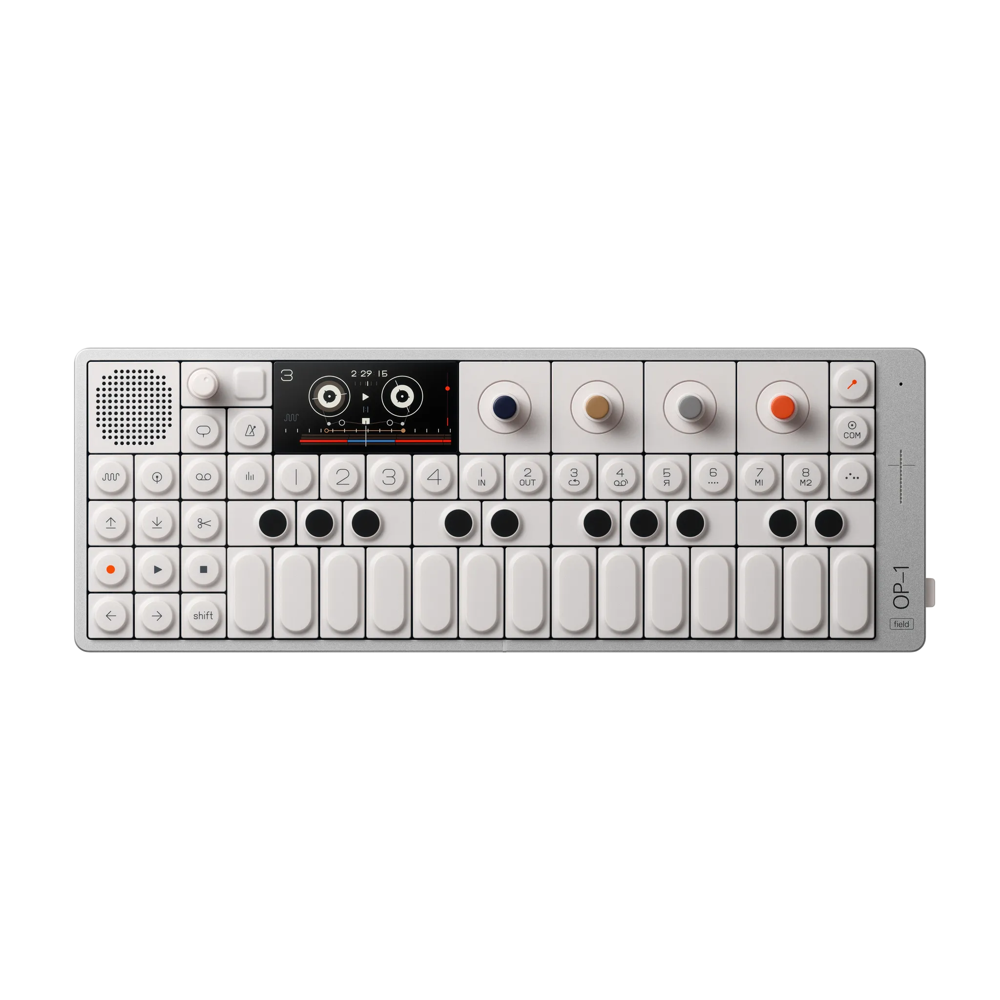

# CSS Key Panel :art:

For CSS To The Rescue I chose the modular control panel assignment. Throughout this documentation, I will be sharing the steps I followed, the challenges I encountered while attempting to create custom form elements using nothing but HTML and vanilla CSS.

The reason I chose the modular control panel assignment is because of its complexity and the creative freedom it allows. It requires creating various custom form elements such as buttons, checkboxes, radio buttons, which can be rather difficult to design and implement in HTML and CSS. However with new CSS selectors such as :has() and :not() (which I have not used before!), I should manage :D. At my current job I work with registration forms on a daily, so I think in the end this assignment will benefit me greatly. 

Additionally, I decided to go for a skeuomorphic look for my control panel design, which means I will attempt to create visual elements that mimic real-world objects.
The reason I chose skeuomorphism is primarily because it allows me to shift my focus on gradients and box-shadows, which I do not typically use in my usual 2D minimalistic style. Creating a realistic look through the use of gradients and box-shadows can be challenging, but I saw this as an opportunity to expand my skill set and challenge myself creatively!

I hope that my process documentation will provide valuable insights into my design choices and the techniques I used to create the modular control panel. Enjoy!

## Week 1: One button at a time

On february 15th, I started my day day by creating a moodboard of skeuomorphic buttons. As I browsed through the web, I ended up stumbling on this synth keyboard called [OP-1 Groovebox by Teenage Engineering](https://teenage.engineering/products/op-1):



The OP-1 Groovebox inspired me to create my control panel in a keyboard type way, so that different types of form elements can always be added into the board. I kind of knew what I wanted, but at the same time I felt lost. This type of design and style of coding (no classes or javascript), is way out of my comfort zone! So, Instead of spending hours thinking of a design, I decided to get started with creating the HTML structure. I reminded myself to not go too crazy as I tend to do and start with a simple button, or in this case a `input[type="checkbox"]` to create an on/off switch.

I initially faced some challenges with the creation of gradients and box-shadows. I mostly experimented with box-shadow effects and found that applying multiple box-shadows to an element can create the soft skeuomorphic effect I was looking for. Except I had no idea what the multiple box-shadows were doing. As mentioned before, I usually stick to a more two-dimensional look and feel, and for some reason never really grasped the CSS syntax of gradients/box-shadows. The only way to figure out what is going on with your CSS is to make things visible by giving everything ridiculous colors. So I did just that.


This helped me understand and actually see what was going on with the box-shadows I continued to the next step: making it look pretty! I kind of thought this would be the easy part, but I struggled with the overall look and feel of the button. Although it looked (kind of) three-dimensional, it didn't feel like a real button. I realized that to achieve a more realistic look, I needed to pay closer attention to details such as shadows, gradients, and borders! In the pictures below you can see a few of the design stages my custom checkbox went through


I basically spent the entire day just experimenting with different box-shadow and gradient effects to create the illusion of depth and texture to the checkbox until I was finally satisfied with the end result.


Because the assignment is called 'Modular control panel', I wondered what would happen if I were to add another button (`checkbox`) into the board, but outside of the form in case the button wouldn't need to rely on a form to check it's validation. And boy was I in for a treat!

My HTML structure was as followed:

```html
<!-- Keyboard container -->
<section>

    <form action="">
        <!-- The 'button' -->
        <fieldset>
            <input type="checkbox" name="power_btn" id="power_btn">

            <!-- Circle container 
                (creates border around circle)-->
            <label for="power_btn">
                <!-- The actual circle 
                    (has gradient to create raised edges illusion) -->
                <div>
                    <!-- Light indicator -->
                    <span></span>
                </div>
            </label>
        </fieldset>

        <fieldset>
            <input type="checkbox" name="power_btn-2" id="power_btn-2">
            <label for="power_btn-2">
                <div>
                    <span></span>
                </div>
            </label>
        </fieldset>
    </form>
</section>
```

With the CSS I wrote at that time, if I moved one of the `fieldsets` outside of the form, it resulted into this silly looking thing that kind of reminded me of a record player:


This 'modular failure' as I call it, showed me I need to either rethink my HTML structure and decide whether or not I will be wrapping everything inside a form element instead of a section, or maybe change up the CSS selectors to hopefully create a more 'global' styling effect.

Even though I only created one little custom checkbox in one really long day, I felt it was a very valuable learning experience for me. I am excited to continue refining my design and applying what I've learned so far to the other form elements.