# CSS Key Panel :art:

For CSS To The Rescue I chose the modular control panel assignment. Throughout this documentation, I will be sharing the steps I followed, the challenges I encountered while attempting to create custom form elements using nothing but HTML and vanilla CSS.

The reason I chose the modular control panel assignment is because of its complexity and the creative freedom it allows. It requires creating various custom form elements such as buttons, checkboxes, radio buttons, which can be rather difficult to design and implement in HTML and CSS. However with new CSS selectors such as :has() and :not() (which I have not used before!), I should manage :D. At my current job I work with registration forms on a daily, so I think in the end this assignment will benefit me greatly. 

Additionally, I decided to go for a skeuomorphic look for my control panel design, which means I will attempt to create visual elements that mimic real-world objects.
The reason I chose skeuomorphism is primarily because it allows me to shift my focus on gradients and box-shadows, which I do not typically use in my usual 2D minimalistic style. Creating a realistic look through the use of gradients and box-shadows can be challenging, but I saw this as an opportunity to expand my skill set and challenge myself creatively!

I hope that my process documentation will provide valuable insights into my design choices and the techniques I used to create the modular control panel. Enjoy!

## Week 1: One button at a time
### Day 1
On february 15th, I started my day day by creating a moodboard of skeuomorphic buttons. As I browsed through the web, I ended up stumbling on this synth keyboard called [OP-1 Groovebox by Teenage Engineering](https://teenage.engineering/products/op-1):

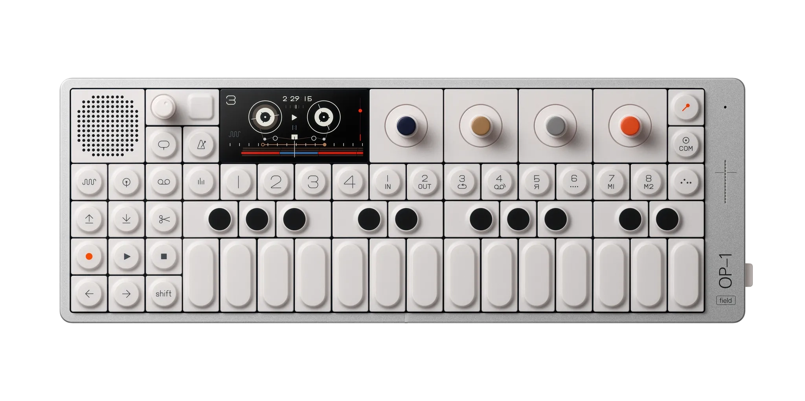

The OP-1 Groovebox inspired me to create my control panel in a keyboard type way, so that different types of form elements can always be added into the board. I kind of knew what I wanted, but at the same time I felt lost. This type of design and style of coding (no classes or javascript), is way out of my comfort zone! So, Instead of spending hours thinking of a design, I decided to get started with creating the HTML structure. I reminded myself to not go too crazy as I tend to do and start with a simple button, or in this case a `input[type="checkbox"]` to create an on/off switch.

I initially faced some challenges with the creation of gradients and box-shadows. I mostly experimented with box-shadow effects and found that applying multiple box-shadows to an element can create the soft skeuomorphic effect I was looking for. Except I had no idea what the multiple box-shadows were doing. As mentioned before, I usually stick to a more two-dimensional look and feel, and for some reason never really grasped the CSS syntax of gradients/box-shadows. The only way to figure out what is going on with your CSS is to make things visible by giving everything ridiculous colors. So I did just that.

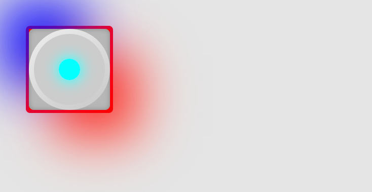

This helped me understand and actually see what was going on with the box-shadows I continued to the next step: making it look pretty! I kind of thought this would be the easy part, but I struggled with the overall look and feel of the button. Although it looked (kind of) three-dimensional, it didn't feel like a real button. I realized that to achieve a more realistic look, I needed to pay closer attention to details such as shadows, gradients, and borders! In the pictures below you can see a few of the design stages my custom checkbox went through

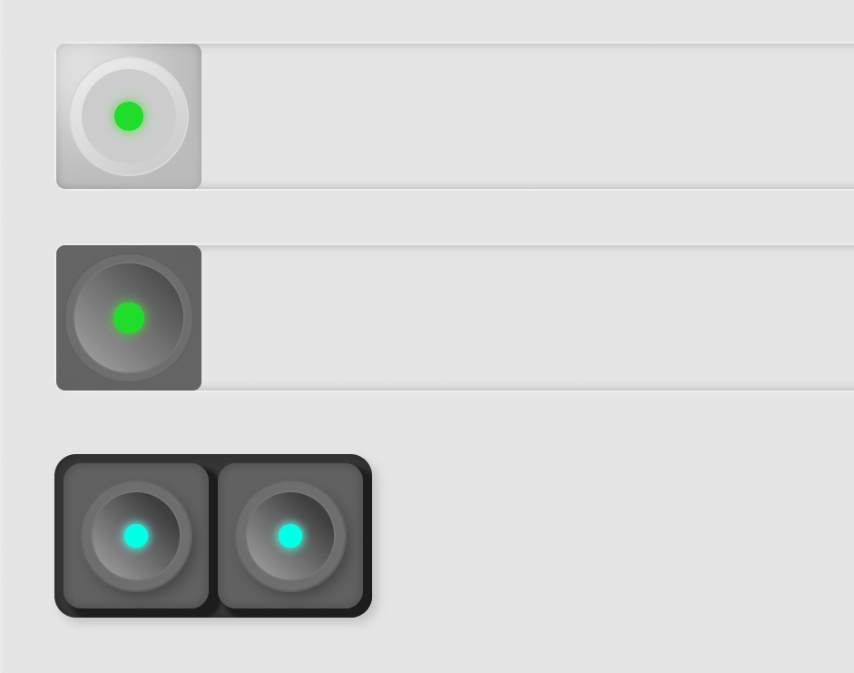

I basically spent the entire day just experimenting with different box-shadow and gradient effects to create the illusion of depth and texture to the checkbox until I was finally satisfied with the end result.

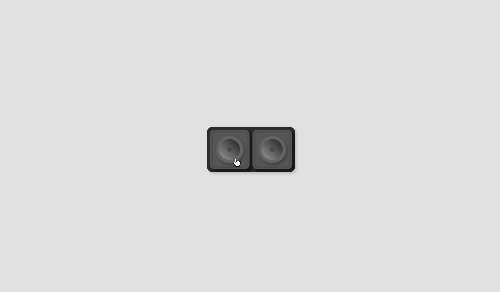

Because the assignment is called 'Modular control panel', I wondered what would happen if I were to add another button (`checkbox`) into the board, but outside of the form in case the button wouldn't need to rely on a form to check it's validation. And boy was I in for a treat!

My HTML structure was as followed:

```html
<!-- Keyboard container -->
<section>

    <form action="">
        <!-- The 'button' -->
        <fieldset>
            <input type="checkbox" name="power_btn" id="power_btn">

            <!-- Circle container 
                (creates border around circle)-->
            <label for="power_btn">
                <!-- The actual circle 
                    (has gradient to create raised edges illusion) -->
                <div>
                    <!-- Light indicator -->
                    <span></span>
                </div>
            </label>
        </fieldset>

        <fieldset>
            <input type="checkbox" name="power_btn-2" id="power_btn-2">
            <label for="power_btn-2">
                <div>
                    <span></span>
                </div>
            </label>
        </fieldset>
    </form>
</section>
```

With the CSS I wrote at that time, if I moved one of the `fieldsets` outside of the form, it resulted into this silly looking thing that kind of reminded me of a record player:

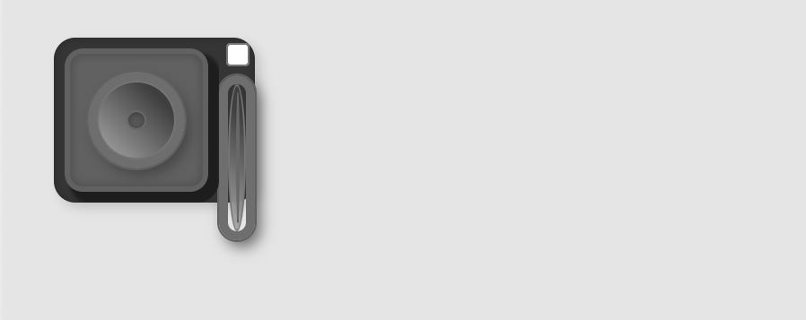

This 'modular failure' as I call it, showed me I need to either rethink my HTML structure and decide whether or not I will be wrapping everything inside a form element instead of a section, or maybe change up the CSS selectors to hopefully create a more 'global' styling effect.

### Day 2

On february 16th I continued working on my button panel, primarily the structure of the HTML. Because I want to make sure my panel is modular, I ended up getting rid of the `section` wrapper. I figured having this wrapper did not add any meaning, becasue the `form` was already acting as a container.

Additionally, I put the `input` inside of my `labels`, this makes sure the input is always clickable (On day 1 this was not the case)! Once I was happy with my HTML structure and had fixed the CSS selectors, I shifted my focus to creating a shadow effect whenever a button is pressed.

For some reason I could not figure out how to approach the situation. I tried many different possible solutions but nothing was really working the way I wanted it to. I tried giving `fieldset + fieldset` a pseudo-element to cast a shadow on the relevant side, except this caused issues with checking when this shadow needed to be shown. After many hours I refactored the shadow element and gave every button it's very own shadow, which logically makes more sense than my other approach. All there was left to do was hide the shadow of the checked checkbox and change the z-index so the checkbox quite literally gets pushed down,

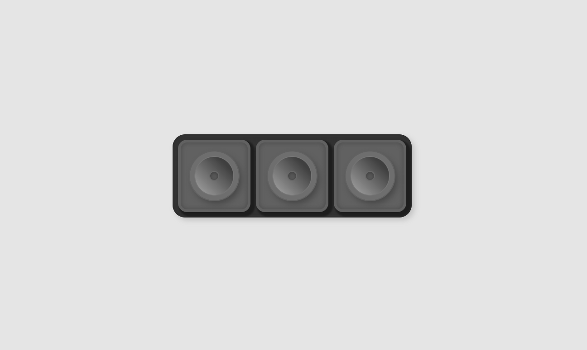

Even though I only created one little custom checkbox in one really long day, I felt it was a very valuable learning experience for me. I am excited to continue refining my design and applying what I've learned so far to the other form elements.

## Week 2: Back to the drawing board
Unfortunately the second week was kind of a slump for me. I was happy with the buttons I had created but I got stuck. I had no clue what to do next or what I wanted to create. Yes, I wanted a keypanel, but what did that keypanel do? What does it trigger other than the reveal of other buttons. I felt a bit discouraged and tried to come up with ideas/designs

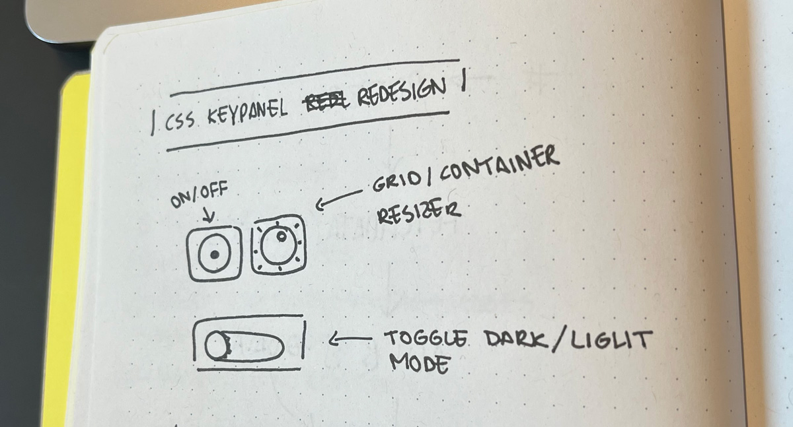
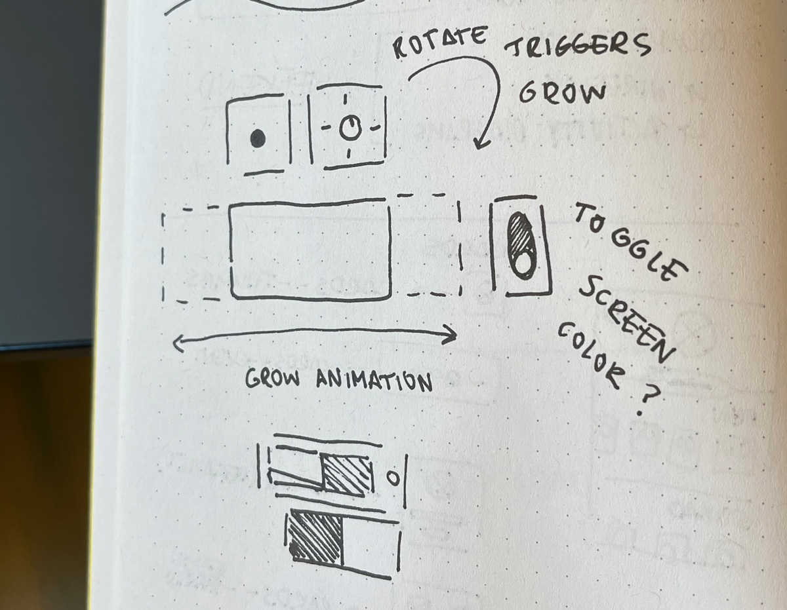

## Week 3: Attributes and rotation animation
During the third week I spent most of my time trying to create the knob type button from my design. I was not really sure what the button was going to do on click, but I just wanted to try and make one.

My first attempt on creating a knob, or rotating button, was to implement a slider element. However, after some digging, I realized making a circular slider was going to take quite a lot of time. Especially without using JS. Because I did not want to waste too much time on one button (which I ended up doing anyway), I decided to go for another checkbox. This is where things got a little interesting.

Because I had based most of the styling of my first button on it being a checkbox, it wasn't as modular as I wanted it to be, because now I had two different types of checkboxes! Meaning, the styling got all messed up:

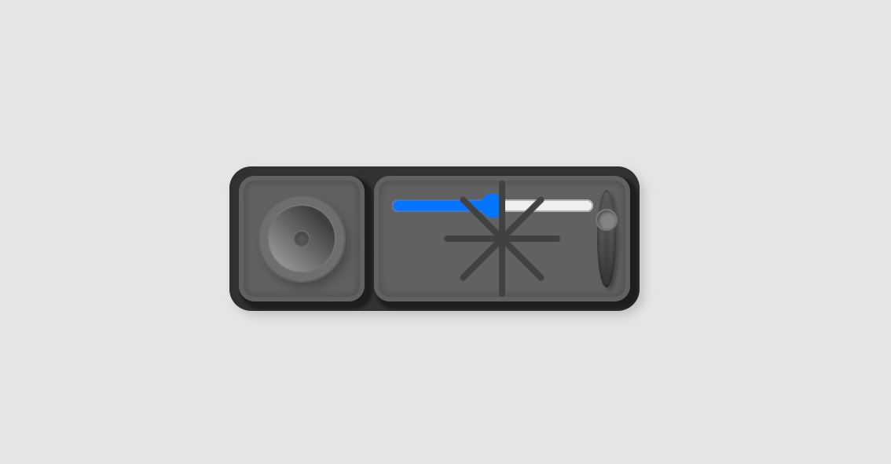

Usually I would be using classnames to distinguish the two from each other, but for this assignment thats considered to be illegal. Therefore I looked into the CSS attribute selector. In a way the attribute selector is kind of similar to the classname selector, however it does add more flexibility in a way. I read [this](https://css-tricks.com/almanac/selectors/a/attribute/) article by CSS Tricks in which they explained the various ways you can use the attribute selector. As stated in their article, here are the seven different ways of using the attribute selector:

```css
[data-value] {
  /* Attribute exists */
}

[data-value="foo"] {
  /* Attribute has this exact value */
}

[data-value*="foo"] {
  /* Attribute value contains this value somewhere in it */
}

[data-value~="foo"] {
  /* Attribute has this value in a space-separated list somewhere */
}

[data-value^="foo"] {
  /* Attribute value starts with this */
}

[data-value|="foo"] {
  /* Attribute value starts with this in a dash-separated list */
}

[data-value$="foo"] {
  /* Attribute value ends with this */
}
```

I figured this would be perfect for my modular keypanel. Overall the buttons have the same styling and shading, so the 'general' styling should be equal. I used a `data-type` to distinguish the difference between button types and `data-form` to define what kind of form we are dealing with (main or not).

Due to the attribute selector I think I have been rather succesfull into making sure my keypanel is modular. I forgot to take screenshots as I was working on the button, so it looked a little different than the picture below, but this is what the knob looks like now:

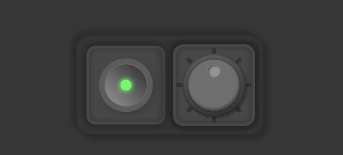

After I got the overall look and feel of the knob button ready, it was time to animate it on click. At first I thought this would be easy, just a simple rotate right? Well, it wasn't exactly what I wanted. It rotated, just not as it would in 'real' life. I had put the rotation animation on the actual knob, which held a lot of styling on its own. 

The tiny rotation indicator was positioned absolute, so adding the rotate transform onto it basically didn't rotate it to the correct location. Another issue with the rotate animation was the box-shadow. Because I put the animation on the actual knob (the big circle), the box-shadow that came with it also rotated! Which would not be happening in real life unless your light source moved along with the rotation. So, I had to come up with something else. 

To make sure the box-shadow of the button stayed in it's initial location, I created another child element on top of the knob and gave it a pseudo-element for the little rotation indicator. Now, the rotate animation only happens on this new child element, and the rotation indicator moves along with it to the 'correct' location.

I now realize I migth have been able to get the slider to work, I think I had somewhat of a tunnelvision when it came to creating the knob button. Using the slider came with the only additional JS script, which added a data attritbute to the HTML tag! I wasn't familiar with the attribute selector before, but I could have used the selector to change the rotation of the button instead of a checkbox.

## Week 4: Finally! Interaction!

During the final week I spent the first two days focused on my CSS assignment. I knew I was behind, so I had to make sure to bring my new design to life before the deadline. 

Because of my data attribute usage it was fairly easy to add another pair of buttons in a different form element. All I had to do was assign an extra type name to the `data-type` attribute and I could get started on styling a fresh new type of button: a toggle!

First, I had to create the 'OLED' screen of the panel. I wanted this display to be different than the regular forms, as its not a form element. The form elements are all slightly raised, noticable by their drop shadows. For the display I did the opposite, the drop shadow was inside, giving the illusion of the display being revealed as it gets pushed into the ground. 

The width of the display then gets controlled by the knob button. After the display has grown to its default size, I used another animation to reveal the new form element contaiing two sets of toggles. I used [this](https://uiverse.io/mobinkakei/great-skunk-8) code example to create my toggle buttons.

Now all that was left was figuring out what I wanted to display in the OLED screens. My friend Chris came up with the idea to draw inspiration from an actual keyboard that I gave to him, the SteelSeries ApexPro, which also has a small OLED screen. I looked up online to see what kind of images or text people put on their OLED screens, and one of them was the BongoCat! Which I found [here](https://www.reddit.com/r/steelseries/comments/mymvhe/bongo_cat_on_my_steelseries_apex_7/).


As you can see, the GIF above is in black/white. This would not match with my current grayish design of the keypanel. I remembered Chris had done some research to CSS filters and blend-modes, so I asked him for help. He told me I could use CSS `blend-mode: lighten` to change the black background color to whatever I wanted to. This was perfect and exactly what I needed! I had never used this before, so it was quite interesting to me.

For the second toggle I wanted another piece of interaction. Sasja mentioned how there is another, more aggressive version of the BongoCat. I thought it would be funny to have the second toggle turn everything into light mode, and then reveal the aggressive version of the BongoCat because it does not like light mode! I found this gif on [here](https://knowyourmeme.com/photos/1421364-bongo-cat).

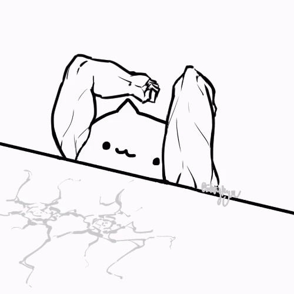

After revealing this GIF I added a shake animation onto the `<main>` tag to create the illusion of the cat shaking the screen. As I'm well aware of this maybe being a bit too much for those who cannot handle a lot of motion, I made sure the additional shaking animation only happens when users have no preference when it comes to motion:

```css

@media (prefers-reduced-motion: no-preference) {
  body:has(form[data-form*="main"]:valid):has(form[data-form="container"]:valid):has(form[data-form="keypanel main"] [data-type*="knob"] input:checked) main {
      animation: shake 200ms ease-in-out infinite;
  }

  @keyframes shake {
      0% {
          transform: translateY(0);
      }
      25% {
          transform: translateY(16px);
      }
      50% {
          transform: translateY(-16px);
      }
      75% {
          transform: translateY(16px);
      }
      100% {
          transform: translateY(0);
      }
  }
}
```

Here's the final result, which can also be viewed [live](https://noyamirai.github.io/css-to-the-rescue-2223/keypanel/):

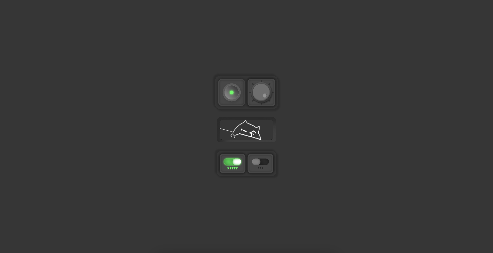
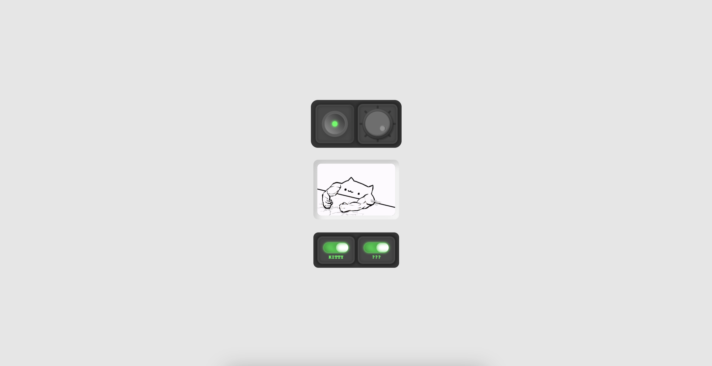

